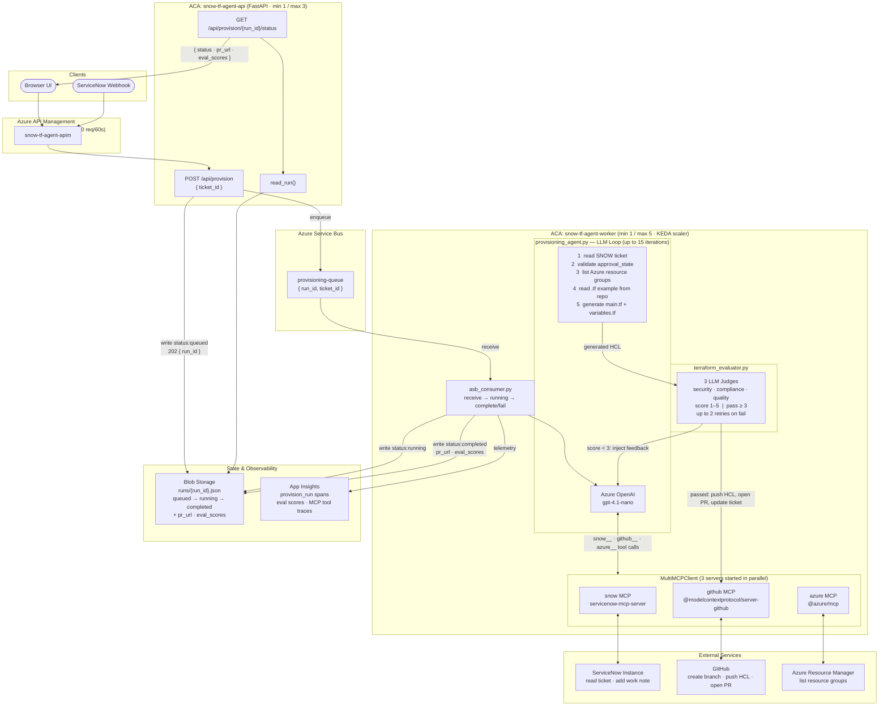

# Snow → Terraform Provisioning Agent

End-to-end ITSM automation agent that reads a ServiceNow infrastructure request
ticket, generates Terraform configuration from GitHub module examples, evaluates
the generated IaC with three LLM judges (security, compliance, quality), opens a
pull request, and updates the ticket — all orchestrated via three MCP servers.

## Architecture



### MCP Servers

Three MCP servers are started simultaneously at request time:

| Server | Default command | Handles |
|---|---|---|
| `snow` | `npx -y @servicenow/now-ai-kit@latest` | Read/update SNOW records |
| `github` | `npx -y @modelcontextprotocol/server-github` | Repo, files, branches, PRs |
| `azure` | `npx -y @azure/mcp@latest server start` | Azure resource inventory |

### Dual Execution Modes

| Mode | Trigger | How it works |
|---|---|---|
| **Async** (production) | `POST /api/provision` when `AZURE_SERVICE_BUS_HOSTNAME` is set | Enqueues to Azure Service Bus → ASB Consumer picks up → runs agent → stores result in Blob Storage |
| **Sync** (development) | `POST /api/provision` without ASB configured | Runs agent inline and returns result directly |

## Prerequisites

- Python 3.11+
- Node 20+ and npm (for MCP server packages)
- A [ServiceNow developer instance](https://developer.servicenow.com) (free)
- A GitHub org/account with a Terraform modules repo (see [Demo Terraform Repo](#demo-terraform-repo) below)
- An Azure OpenAI deployment with a chat model (e.g. `gpt-4.1-nano`, `gpt-4o`)
- An Azure subscription (for production ACA deployment — not needed for local sync mode)

## Quick Start (local / sync mode)

```bash
cd snow-terraform-agent
python -m venv .venv && source .venv/bin/activate
pip install -r requirements.txt

# Configure credentials
cp .env.example .env
# Edit .env with your ServiceNow, GitHub, and Azure OpenAI credentials

# Start the server
uvicorn src.main:app --host 0.0.0.0 --port 8020 --reload
```

Open **http://localhost:8020** in a browser, enter a ServiceNow RITM number, and click **Run Provisioning**.

## Production Deployment (Azure)

```bash
# 1. Edit infra/setup.sh — fill in the CONFIGURE THESE block at the top
# 2. Export secrets:
export SERVICENOW_PASSWORD="your-snow-password"
export GITHUB_PAT="ghp_..."

# 3. Run the setup script (~15 min)
bash infra/setup.sh
```

The script provisions: Resource Group, Log Analytics, App Insights, Service Bus, Blob Storage, ACR, Managed Identity, Key Vault, ACA Environment, ACA API + Worker apps, KEDA scaler, and APIM gateway.

## API

```
POST /api/provision
  Body: {"ticket_id": "RITM0001234", "max_iterations": 15}
  Async mode → {"run_id": "...", "ticket_id": "...", "status": "queued"}
  Sync mode  → {"ticket_id": "...", "pr_url": "...", "summary": "...", ...}

GET  /api/provision/{run_id}/status
  Returns: {"status": "running|completed|failed", "pr_url": "...", "eval_scores": {...}}

GET  /health  →  {"status": "ok"}
GET  /        →  browser UI
```

## ServiceNow Business Rule Setup

To trigger the agent automatically when a ticket is approved:

1. In your ServiceNow instance → **System Definition → Business Rules → New**
2. Set:
   - **Table**: `sc_req_item [sc_req_item]`
   - **When**: after update
   - **Condition**: `current.approval == 'approved' && previous.approval != 'approved'`
   - **Advanced** (Script):
     ```javascript
     var rm = new sn_ws.RESTMessageV2('ProvisioningAgent', 'trigger');
     rm.setStringParameterNoEscape('ticket_id', current.number);
     rm.execute();
     ```
3. Create the REST Message under **System Web Services → Outbound → REST Messages**:
   - **Endpoint**: `https://<your-apim-hostname>/api/provision`
   - **HTTP Method**: POST
   - **Headers**: `Content-Type: application/json`
   - **Body**: `{"ticket_id": "${ticket_id}"}`
   - Add any APIM subscription key header if required

The agent will be called with the RITM number, read the ticket, validate approval and cost center, then proceed with Terraform generation and PR creation — or write back to the ticket if blocked.

## Workflow

1. `snow__*` — read ticket: extract `short_description`, `approval`, `cost_center`
2. **Approval gate** — if `approval != "approved"`: write blocking work note to ticket, return `blocked` status, stop
3. **Cost center gate** — if no cost center found in description: write blocking work note, return `blocked` status, stop
3. `azure__*` — list resource groups for naming context
4. `azure__*` — list resource groups for naming context
5. `github__*` — find the Terraform modules repository and read an example `.tf` file
6. LLM generates `main.tf` + `variables.tf` using the example as a template
7. **Terraform Evaluator** — 3 LLM judges (security, compliance, quality) each score 1–5
   - All scores ≥ 3 → pass, continue to step 8
   - Any score < 3 → LLM regenerates HCL (up to 2 retries), then back to step 7
8. `github__*` — create branch `feature/provision-{ticket_id}`
9. `github__*` — push `main.tf`
10. `github__*` — push `variables.tf`
11. `github__*` — open pull request with ticket context in the description
12. `snow__*` — add work note to ticket with PR URL
13. Evaluation scores logged to App Insights as traces (search `Eval:` in Transaction Search)

## Environment Variables

| Variable | Required | Description |
|---|---|---|
| `AZURE_OPENAI_ENDPOINT` | ✓ | Azure OpenAI endpoint URL |
| `AZURE_OPENAI_DEPLOYMENT_NAME` | ✓ | Model deployment name (e.g. `gpt-4.1-nano`) |
| `AZURE_OPENAI_USE_AZURE_AD` | | `true` (default) uses az login / MI; `false` uses API key |
| `AZURE_OPENAI_API_KEY` | | Required only if `USE_AZURE_AD=false` |
| `SERVICENOW_INSTANCE_URL` | ✓ | e.g. `https://devXXXXXX.service-now.com` |
| `SERVICENOW_USERNAME` | ✓ | ServiceNow username |
| `SERVICENOW_PASSWORD` | ✓ | ServiceNow password |
| `GITHUB_PERSONAL_ACCESS_TOKEN` | ✓ | GitHub PAT (repo + workflow scopes) |
| `GITHUB_ORG` | ✓ | GitHub org/user owning the Terraform repo |
| `GITHUB_TERRAFORM_REPO` | | Terraform modules repo name (default: `terraform-modules-demo`) |
| `SNOW_MCP_COMMAND` | | Override ServiceNow MCP start command |
| `GITHUB_MCP_COMMAND` | | Override GitHub MCP start command |
| `AZURE_MCP_SERVER_COMMAND` | ✓ | Full command to start Azure MCP server |
| `AZURE_SUBSCRIPTION_ID` | ✓ | Azure subscription ID for resource inventory |
| `AZURE_SERVICE_BUS_HOSTNAME` | | ASB namespace hostname — enables async mode |
| `AZURE_SERVICE_BUS_QUEUE_NAME` | | ASB queue name (default: `provisioning-queue`) |
| `AZURE_STORAGE_ACCOUNT_NAME` | | Blob storage account for job state (async mode) |
| `AZURE_STORAGE_CONTAINER_NAME` | | Blob container (default: `runs`) |
| `AZURE_CLIENT_ID` | | User-assigned MI client ID (set automatically by ACA) |
| `APPLICATIONINSIGHTS_CONNECTION_STRING` | | App Insights connection string for telemetry |

## Demo Terraform Repo

The agent needs a GitHub repository containing Terraform module definitions and usage examples. It uses these as few-shot context when generating new configurations.

**Required structure:**
```
modules/
  <resource-type>/
    main.tf
    variables.tf
    outputs.tf        (optional)
examples/
  <resource-type>-example/
    main.tf           ← agent reads this as a template
```

You can fork the reference repo at [`natesanshreyas/terraform-modules-demo`](https://github.com/natesanshreyas/terraform-modules-demo) which includes modules for `resource-group`, `storage-account`, and `openai`. Set `GITHUB_ORG` and `GITHUB_TERRAFORM_REPO` to point at your fork/copy.

## File Structure

```
snow-terraform-agent/
├── src/
│   ├── __init__.py
│   ├── main.py                 FastAPI app, dual-mode API (async/sync)
│   ├── provisioning_agent.py   LLM agent loop with eval-retry logic
│   ├── multi_mcp_client.py     MultiMCPClient — manages 3 MCP servers
│   ├── terraform_evaluator.py  3 LLM judges (security/compliance/quality)
│   ├── asb_consumer.py         Azure Service Bus worker process
│   ├── asb_sender.py           Enqueue messages to ASB
│   ├── blob_store.py           Azure Blob state store for job tracking
│   ├── telemetry.py            OpenTelemetry + App Insights integration
│   ├── openai_client.py        Azure OpenAI wrapper with retry
│   └── ui.html                 Browser UI
├── infra/
│   └── setup.sh                Full Azure infrastructure setup (az CLI)
├── Dockerfile                  Multi-stage: Node 20 + Python 3.11
├── requirements.txt
└── .env.example
```

## Known Limitations

- **Blob storage status polling**: The `GET /api/provision/{run_id}/status` endpoint requires `AZURE_STORAGE_ACCOUNT_NAME`. In some Azure lab/sandbox subscriptions, Managed Identity blob writes may fail with 403 despite correct role assignments — this is a subscription-level policy issue. Evaluation scores and completion status are always available in App Insights Transaction Search (filter by `Eval:` or `provision_run`).

- **KEDA autoscaler**: The ASB KEDA scaler requires a connection string secret that resolves at runtime. If it fails to fetch queue metrics, the worker still processes messages as long as `min-replicas ≥ 1`. Set `min-replicas=1` on the worker app as a workaround.

- **Branch reuse**: If a provisioning run for a ticket ID fails after creating the GitHub branch, re-running the same ticket will hit a "Reference already exists" error. Delete the stale branch in GitHub before retrying.

- **Foundry evaluation dashboard**: Azure AI Foundry project creation may be blocked by subscription policies (`publicNetworkAccess: Disabled`). Evaluation scores are logged to App Insights as an alternative — search `Eval:` in Transaction Search to see per-run scores.
